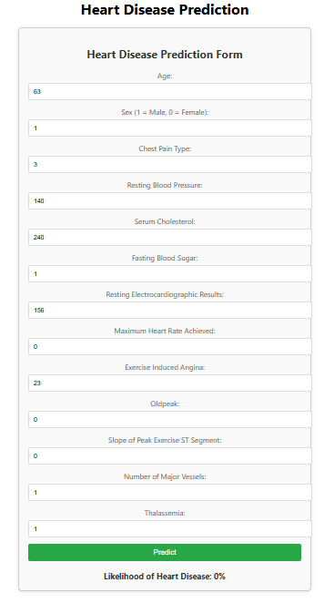

# Heart Disease Prediction Web Application

 <!-- Add a path to your image here -->

## Overview
Welcome to the Heart Disease Prediction Web Application! This project leverages machine learning to predict the likelihood of heart disease based on user input data. With an intuitive interface, you can quickly assess your heart health!

## Features
- **User-Friendly Interface**: Easily input health data and get predictions.
- **Real-Time Predictions**: Instant feedback on the likelihood of heart disease.
- **API Integration**: Backend API that processes the input and returns predictions.

## Getting Started

### Prerequisites
Before you begin, ensure you have the following installed:
- [Node.js](https://nodejs.org/) (for the frontend)
- [Python](https://www.python.org/downloads/) (for the backend)
- [Flask](https://flask.palletsprojects.com/) (for the backend API)

### Installation

1. **Clone the Repository**
   ```bash
   git clone https://github.com/TuryahabwaPaul/heart-disease-regression.git
